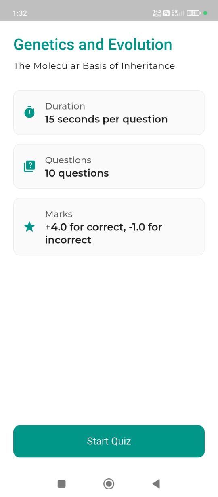
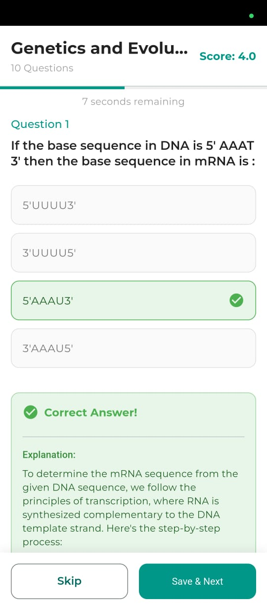
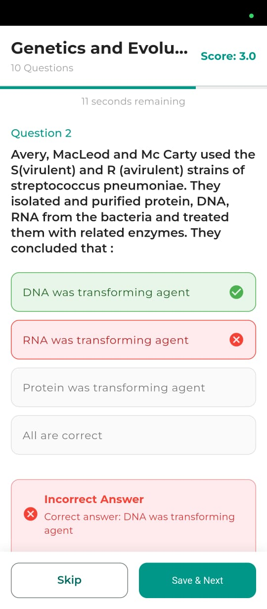
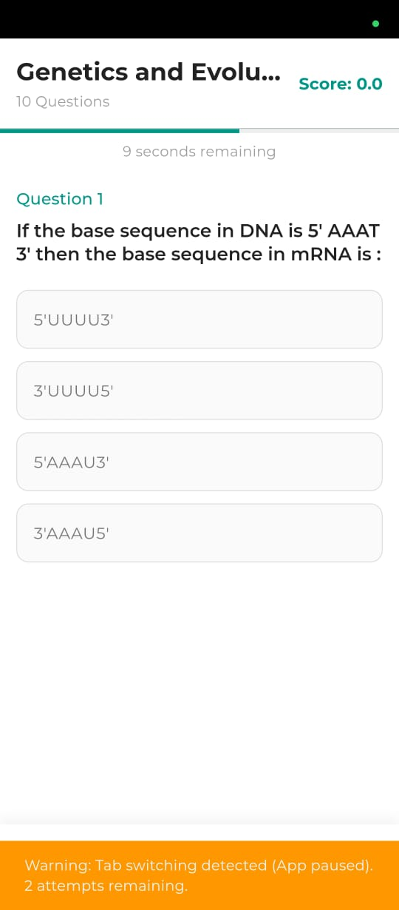
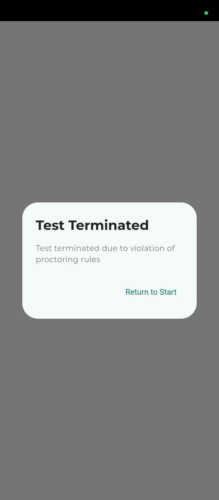
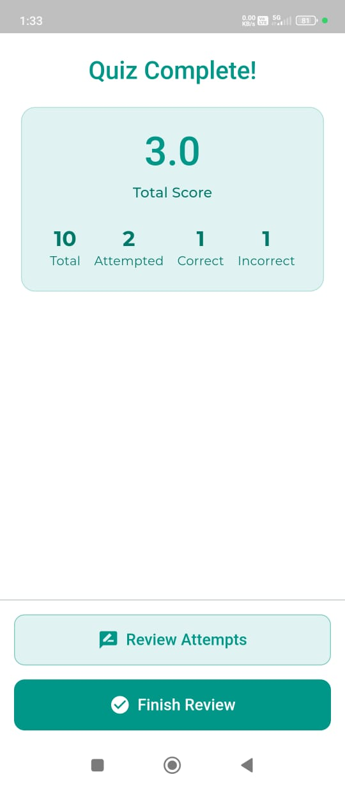
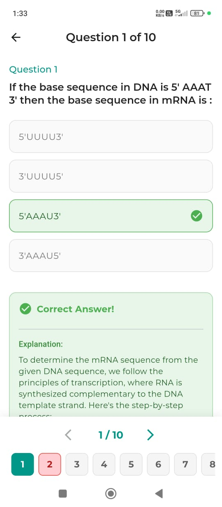
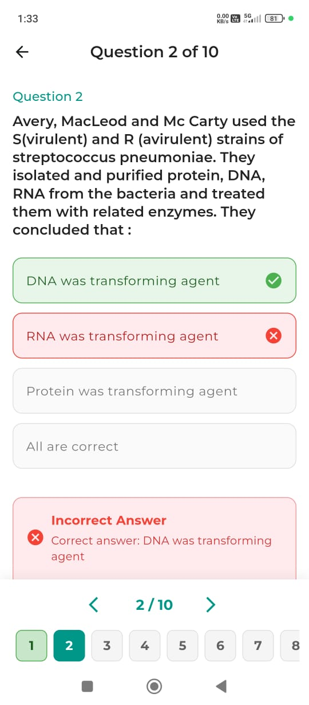
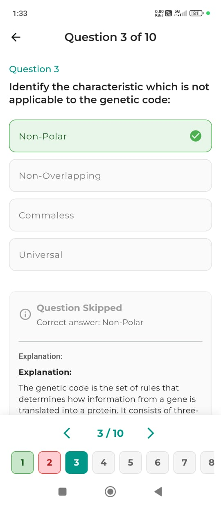
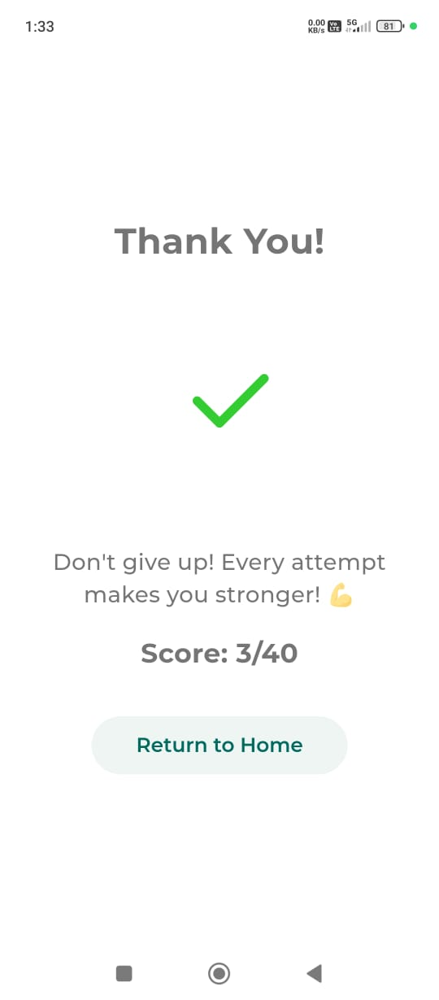

# Testline App

A modern quiz application built with Flutter, designed to provide a seamless testing experience across mobile and desktop platforms. Download our [Windows App](https://github.com/Chandrakant0110/testline_app/releases/download/v1.0.2/Release.exe) or [Android App](https://github.com/Chandrakant0110/testline_app/releases/download/v1.0.2/testline_app_v1.0.2.apk).

[](https://github.com/Chandrakant0110/testline_app)

## App Previews

Check out Testline in action:
- [Windows App Preview](https://youtu.be/u5r25c1j1o8)
- [Android App Preview](https://youtu.be/nTxhdRwwLic)

## Screenshots

Here's a walkthrough of the app interface:

### Getting Started
<p align="center">
  
</p>

### Quiz Experience
<p align="center">
  
  
</p>

### Security Features
<p align="center">
  
  
</p>

### Results & Review
<p align="center">
  
  
  
</p>
<p align="center">
  
  
</p>

## What makes Testline special?

- 📱 **Cross-Platform**: Works smoothly on both mobile and desktop
- ⚡ **Real-time Scoring**: Instant feedback as you progress
- 🔒 **Secure Testing**: Built-in proctoring to maintain test integrity
- 🎨 **Modern UI**: Clean, intuitive interface with smooth animations
- 📊 **Detailed Analytics**: Comprehensive performance tracking

## Core Features

### For Test Takers
- Take timed quizzes with flexible navigation
- Track your progress in real-time
- Review answers with detailed explanations
- Access study materials within the app
- Get instant performance analytics

### For Test Creators
- Configure custom scoring rules
- Set time limits per question/quiz
- Enable/disable question shuffling
- Add rich markdown-formatted questions
- Integrate study materials

### Security Features
- App state monitoring
- Anti-cheating measures
- Secure test termination
- Activity logging

## Getting Started

### Requirements
- Flutter SDK (latest stable)
- Dart SDK
- For desktop: Windows/Linux/macOS development setup

### Quick Start

1. Clone the repo:
```bash
git clone https://github.com/Chandrakant0110/testline_app
```

2. Move to project directory:
```bash
cd testline_app
```

3. Get dependencies:
```bash
flutter pub get
```

4. Launch the app:
```bash
flutter run
```

## Project Layout
```
lib/
├── models/      # Data structures
├── screens/     # UI screens
├── service/     # Business logic
├── theme/       # Styling
└── widgets/     # Reusable components
```

## Tech Stack

- **UI**: Flutter & Dart
- **Animations**: flutter_animate, animated_text_kit
- **Content**: flutter_markdown
- **Desktop**: window_manager

## Want to Contribute?

We welcome contributions! Feel free to:
1. Fork the repository
2. Create a feature branch
3. Submit a pull request

## License

MIT License - feel free to use and modify as needed.
